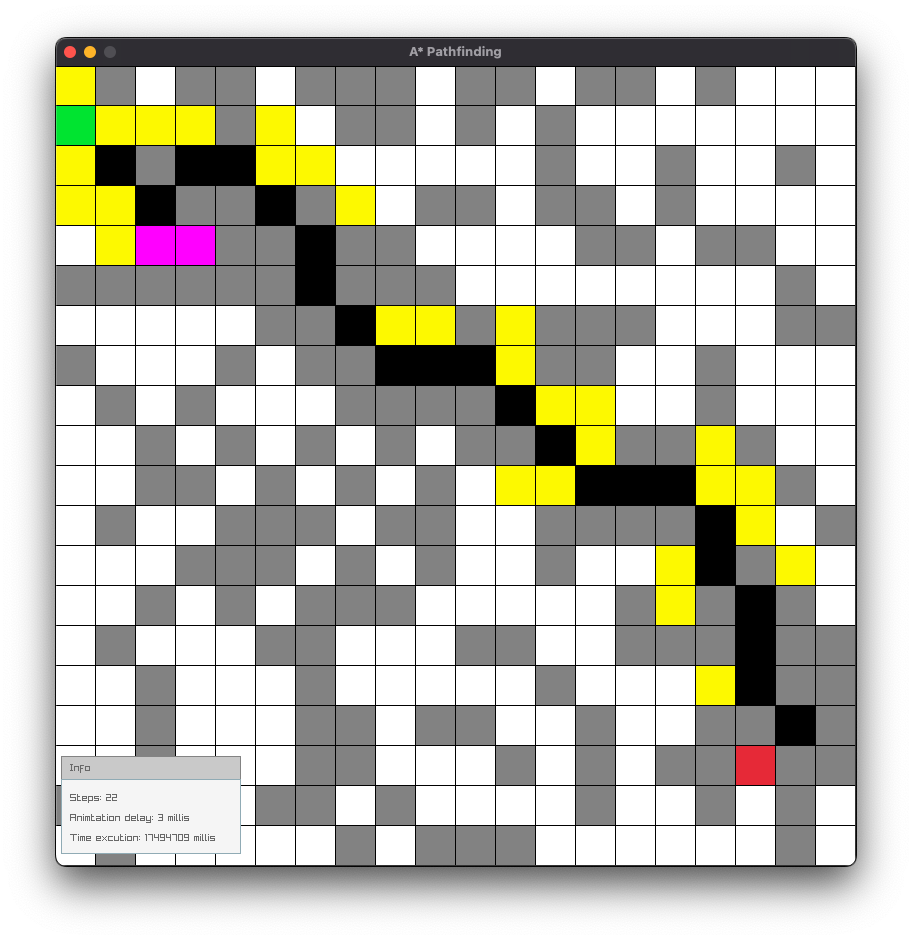
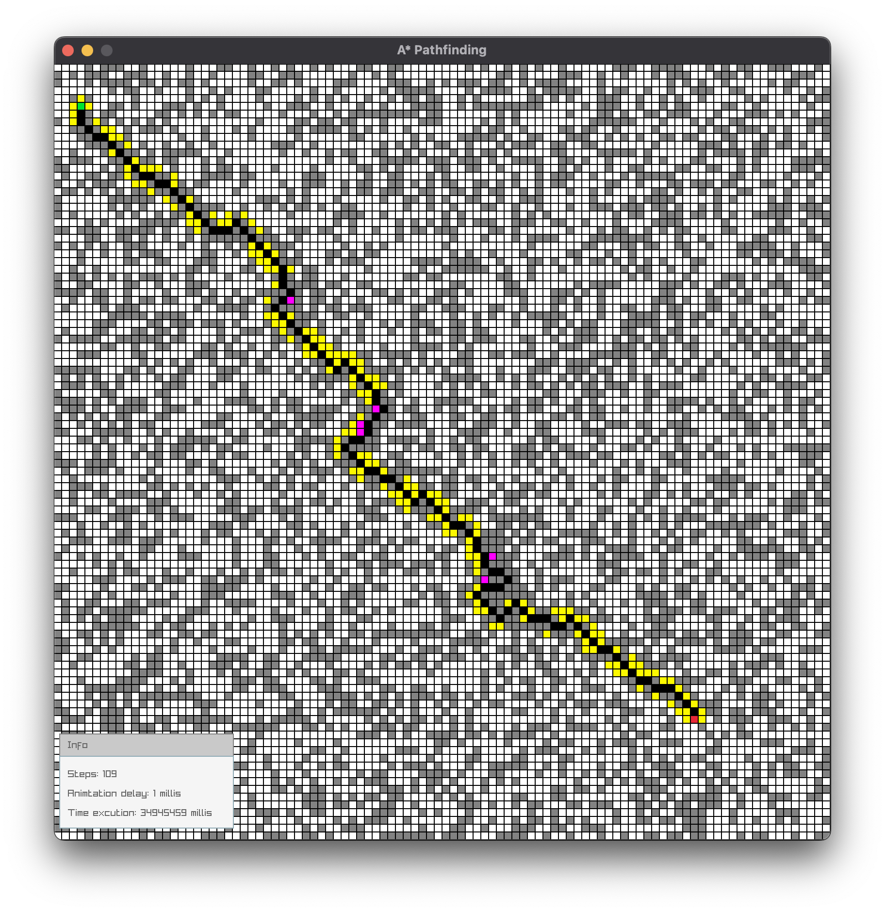
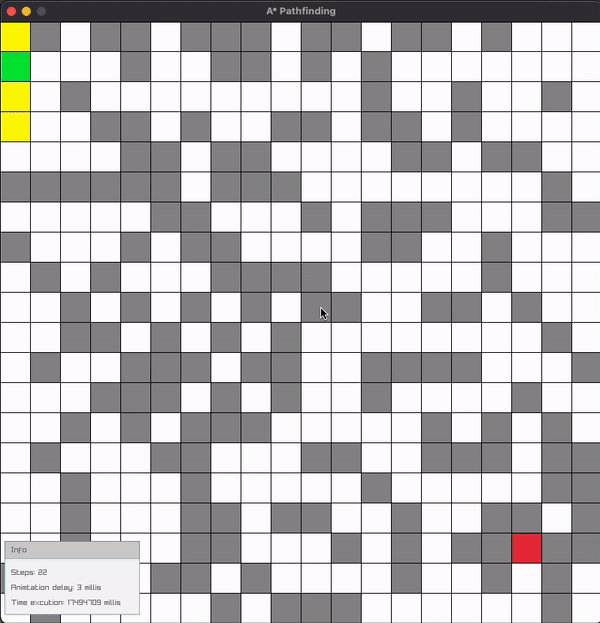

# A*(star) Pathfinding Visualization 
This project is a visual representation of the [A* (star)](https://en.wikipedia.org/wiki/A*_search_algorithm) pathfinding algorithm, built using Java and [RayLib](https://www.raylib.com/index.html).

# What is A*(star)?
A*(star) is one of the most successful search algorithms to find the shortest path between nodes or graphs. It is an informed search algorithm, as it uses information about path cost and also uses heuristics to find the solution.

<p align="right">-towardsdatascience.com</p>


# Configure the app before you run it
Inside `main.java` you will find the following three variables.

```java
//The ROWS variable holds the number of rows that the grid has.
// By changing its value you will also affect the number of columns because rows = columns.(DEFAULT = 20)
final int ROWS = 20;

//The allowDiagonal variable according to it's value(true or false) allows diagonal movement.(DEFAULT = true)
final boolean allowDiagonal =true;

//The animated variable enables the animated visual representation of pathfinding.(DEFAULT = true)
final boolean animated = true;

//The animationDelay variable controls the delay of animated visual representation. 
// You can also update this variable during app execution using up and down arrows (Check controls section). 
// During execution the minimum and maximum value extends from number 1 to number 8. (DEFAULT = 1)
int animationDelay = 1;
```

# Controls
* **"Left click" (LMB)** to create obstacles.
* **"Right click" (RMB)** to delete obstacles.
* **"S"** to add the start point.
* **"E"** to add the end point.
* **"R"** to reset. ~~(Do not to press the R button when the animation runs,it will lead to an exception.)~~
* **"G"** to place random obstacles on the grid.
* **"F"** to enable and disable free camera movement in the 2d space.
* **"Up arrow"** to increase animation delay.
* **"Down arrow"** to decrease animation delay.
* **"SPACEBAR"** to start the algorithm.

# Platforms
This app can be executed in the following list of operating systems:
* Windows x86_64
* macOS x86_64
* Linux x86_64
* Linux arm (Raspberry Pi only)

For macOS arm64 and any other arm based operating system, you will need to build your own JayLib binary.

# Screenshots & Videos






# Important note
This project is not yet completed.I' sure some of you,will experience bugs and crashes.There is a lot of things to be rethinked and fixed,so feel free to report any issues.

# Built with
* Java (version 17) and Grable
* [RayLib](https://www.raylib.com/) ([Jaylib - Java binding](https://github.com/electronstudio/jaylib/))